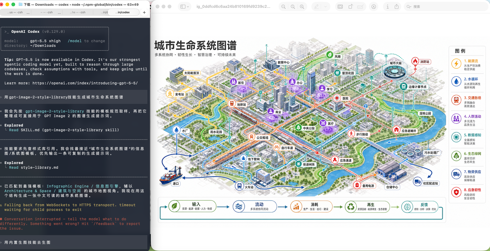

# GPT-Image2 Style Library

Use this skill to turn a user's image-generation intent into a production-ready GPT-Image2 prompt using the awesome-gpt-image-2 style library.

## Example Output



Example request: `用 gpt-image-2-style-library 技能生成城市生命系统图谱`

## Reference

- Read `references/style-library.md` before choosing a template or style.
- The reference is generated from `data/style-library.json` in the repository.
- Prefer the reference over memory when template names, categories, covers, or style tags matter.

## Workflow

1. Detect the user's language and answer in that language.
2. Identify the user's target output: product, poster, UI, infographic, brand, photo, illustration, character, scene, history, document, or special task.
3. Match the request in this order: template category, visual style tag, scene tag, then nearest example cases.
4. If one template is clearly strongest, use it directly. If several are plausible, present 2-3 options with short reasons and ask the user to choose.
5. Build the final prompt with these blocks:
   - subject and task
   - composition and layout
   - visual style and materials
   - text and label requirements
   - aspect ratio and output format
   - constraints and negative details
6. Include the selected template name and any useful example case IDs.

## Output Defaults

- Provide a copyable prompt first.
- Keep constraints concrete: exact text, aspect ratio, readable labels, layout hierarchy, and avoided artifacts.
- For Chinese requests, write the final prompt in Chinese unless the user asks for English.
- For English requests, write the final prompt in English unless the user asks for Chinese.
- When the user asks for multiple concepts, reuse one template and vary subject, composition, palette, and scene.

## Maintenance

When the source repository changes, run:

```bash
npm run generate:style-skill
```

To install the skill into the local Codex skill folder, run:

```bash
npm run install:skill
```
